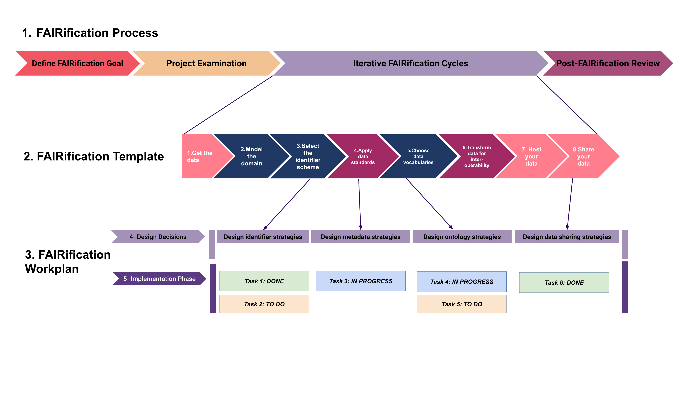
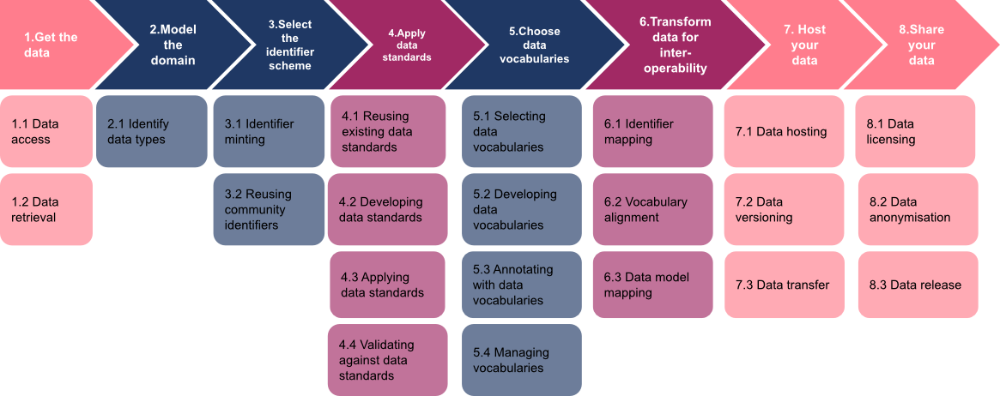

# The FAIRification Framework

The FAIRification Framework (FIGURE 1) provides a structured, step-by-step approach and supporting resources for transforming datasets, digital objects, or data management practices into FAIR-compliant assets.
It guides users through the entire FAIRification journey — from assessing the initial state of their assets, implementing targeted FAIRification goals, to re-evaluating the FAIR status of the assets after implementation.

The Framework adopts FAIR principles by making optimal use of available resources and enhancing an organization’s capacity for FAIR data management. It does so by prioritizing needs based on a thorough analysis of the specific FAIR challenges unique to each project. By following its structured phases, organizations can ensure their data becomes discoverable, accessible, interoperable, and reusable – unlocking its full potential for scientific research, innovation, and collaboration.  

The Framework is comprised of three components (FIGURE 1): 
1.	**The FAIRification Process** is the reusable process which outlines the main phases of a FAIRification activity.
2.	**The FAIRification Template** breaks down the key elements of the process into a series of steps to follow when undertaking a FAIR transformation.
3.	**The FAIRification Workplan** provides a structure for organizing FAIR implementation work tailored to the needs of a specific project.

_The FAIRification Template and the FAIRification Workplan, are available to support users as needed._

_**Figure 1 - Overview of the FAIRification Framework**_  
_The four phases of the FAIRification Process are supported, if needed, but the **"FAIRification Template"** and the **"FAIRification Workplan"**._  

### 1. The FAIRification Process  

The FAIRification Process structures the FAIRification project into 4 distinct phases described below.

#### A.	Define FAIRification Goal - set realistic and practical goals
  
Before any FAIRification work is undertaken, it is essential to identify the intended usability of the data that cannot be achieved in its current state. From this, one or more clear and specific FAIRification goals should be defined. Since FAIRification efforts incur  costs and may not produce equally valuable benefits, it is advisable to establish an acceptable “FAIR enough” end state – one in which the most critical capabilities are achieved, while less impactful enhancements may be set aside. To be actionable, these goals must be translated into concrete tasks.

#### B. Project Examination - initial project examination  
  
FAIRification is challenging if the project's capabilities and resources are not fully understood from the beginning. It is therefore essential to:
-	Identify Data Requirements
For example, goals relating to data hosting improvements cannot be fulfilled if data is not available or accessible or if the project partners have not reached an agreement on the appropriate licensing and data use conditions.
-	Identify FAIRification Capabilities & Resources
For example, assess the needed expertise and plan accordingly for budget and personnel availability.
-	Produce the FAIRification Backlog
For example, for some or all sections of the project examination, list the current and projected status of each individual task. The FAIRification Workplan may support this process – see below for details. 

#### C. Iterative FAIRification Cycles
  
The practical phase of the FAIRification Process centers on the FAIRification Cycle, which consists of three distinct stages: Assessment, Design, and Implementation. This phase typically involves multiple FAIRification Cycles applied iteratively. Each cycle focuses on a defined set of tasks within an agreed timeframe.
-	Assessment
Pre- and post-assessments are conducted at the beginning and end of each FAIRification Cycle iteration to evaluate FAIR improvements and track the status of individual tasks.
-	Design
During the design stage, concrete steps are identified to achieve the FAIRification tasks identified for this cycle. If needed, one could also use the concrete steps identified from the FAIRification template – see below.
These steps form the FAIRification workplan to be realised during the implementation stage – see below.
-	Implementation
During this phase, the planned tasks are executed within the established timeframe. However, it is important to note that some tasks may remain incomplete, be postponed, or even abandoned during a given iteration.

#### D. Post-FAIRification Review
  
In this final phase, the cumulative outputs of all FAIRification activities are reviewed against the initial project goals to evaluate the overall success of the process. The review should include a summary of key achievements, documented FAIR improvements, an overview of the FAIRification processes, and any lessons learned.

### 2. The FAIRification Template  

The FAIRification Template operationalizes the FAIRification Process by outlining a set of clear, distinct steps for the implementation stage within the FAIRification Cycle. It comprises eight steps covering areas such as hosting capabilities (e.g., data access, data retrieval, versioning, etc.), data representation and format (e.g., applying data standards and aligning vocabularies, etc.), and data content (e.g., identifier minting and annotation with controlled vocabularies, etc). The Template supports users as needed by offering concrete tasks commonly encountered across FAIRification efforts.
### 3. The FAIRification Workplan  

The FAIRification Workplan is a tailored design and implementation plan, customized for a specific project by selecting relevant elements from the FAIRification Template. These elements are chosen based on the project examination to achieve the defined FAIRification goals. As such, the Workplan directly supports the overall FAIRification Process.